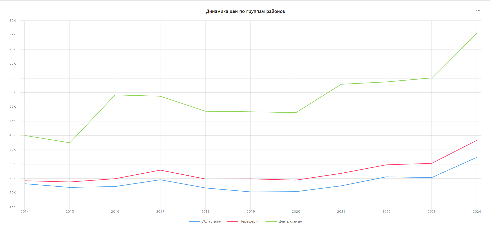
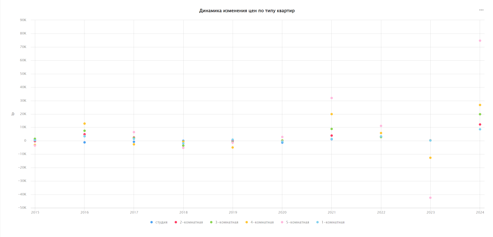
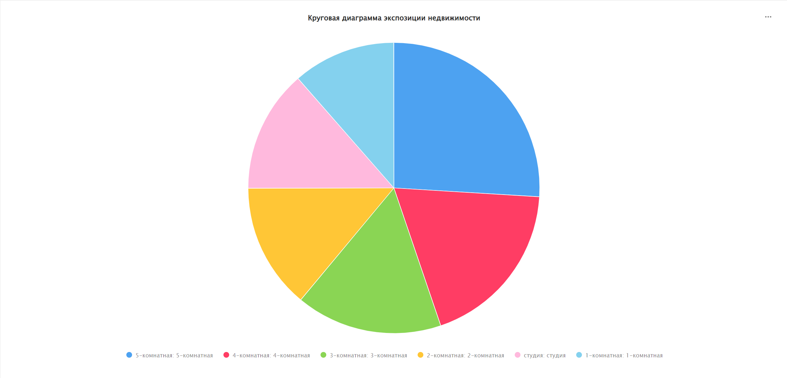

# Анализ рынка аренды на современном стеке

Приветствую, меня зовут Лиза и я увлекаюсь анализом данных. В этой статье рассмотрим анализ рынка аренды в г. Санкт-Петербург и ближайшей области на современном стеке. Использовать будем:
- Python 3.11 & Pandas - для экстракции и подготовки данных
- DuckDB - для обработки и загрузки данных в хранилище
- PostgreSQL 17 - для анализа и построения витрин данных
- DataLens - для визуализации результатов
<!-- - ??? dbt - для создания итоговых моделей-->
<!--ыявить закономерности бла-бла-бла ...--> 

В качестве входных данных будем использовать:
- фактовую информацию о времени публикации, сдачи, цене, а также о некоторых прочих характеристиках объекта, взятую из [источника](https://realty.yandex.ru/otsenka-kvartiry-po-adresu-onlayn/),
- и измерения c информацией по [домам](https://dominfospb.ru) и [районам](https://spb.ginfo.ru/ulicy/) города.

А получать их будем путем скрапинга с использованием `requests` и фреймворка `playwright`. С кодом скриптов можно ознакомиться [тут](...).

## Подготовка данных
Подготовку начнем с получения и обработки измерений по домам (в дальнейшем они же понадобятся для получения фактов).

Запускаем [скрипт]() и по окончании скрапинга можем видеть итоговые данные типа `list[dict[str, str]]` ... 26291 строку.

Читаем выходной JSON файл через `pd.read_json()` и получаем датафрейм `dim_houses`, состоящий из ряда технических атрибутов и крайнего атрибута `extra`, содержащего уже нужные нам данные в виде списка строковых HTML-кодов. <!--Поправить скрапинг???-->

Пример содержимого `extra` для некоторой случайной строчки:
```html
<section class="required-fields">
    <h2><span>Сведения о доме</span></h2>
    <div class="field field-name-...">
        <div class="field-label">Субъект РФ (наименование):</div>
        <div class="field-items">
            <div class="field-item even">Санкт-Петербург</div>
        </div>
    </div>
    <div class="field field-name-...">
        <div class="field-label">Адрес дома:</div>
        <div class="field-items">
            <div class="field-item even">г. Санкт-Петербург, Бульв. Алексея Толстого, д. 17</div>
        </div>
    </div>
    ...
</section>
```

Далее попробуем распарсить HTML-код и отфильтровать данные при помощи регулярных выражений. Используем для этих целей следующую функцию:
``` python
from functools import reduce
from re import findall

f = lambda z: reduce(
    lambda x, y: {**x, **y}, [dict(zip(
        findall(r'\<div class\=\"field\-label\"\>([^:<]*)', e), 
        findall(r'\<div class\=\"field\-item even\"\>([^:<]*)', e)
    )) for e in z]
) if z else None
```
Задача этой функции - выделить ключи и значения соответствующих атрибутов объектов недвижимости (например, год постройки, тип дома, адрес дома и т.д). Полученные пары "ключ-значение" преобразовать в словари, а затем объединить их в рамках одного общего словаря через `reduce()`.

Через `apply()` применим эту функцию ко всей колонке `extra`, а после при помощи `pd.json_normalize()` разнесем ключи полученного словаря на отдельные колонки датафрейма и смерджим их в изначальный датафрейм.

```python
dim_houses = dim_houses.merge(
    pd.json_normalize(dim_houses['extra'].apply(f, axis=1)),
    left_index=True
    right_index=True
)
```

Далее выделим уникальный идентификатор дома - просматривая данные, можем заметить, что в датафрейме `dim_houses` в колонке `house_url` содержатся ссылки на страницы домов с [сайта-источника](https://dominfospb.ru/), например: https://dominfospb.ru/dom/9134508. Для упрощения взаимодействия с данными и однозначной идентификации жилых объектов преобразуем содержимое этой колонки и выделим уникальные числовые идентификаторы в конце URL пути.

Чтобы отделить основную часть ссылки от нужных мне значений используем следующую лямбда-функцию. 
```python
hurl = lambda x: x.split('/')[-1].split('-')[0]
```

Эта функция разделяет строку URL по символу `/` и выделяет только последний элемент. Таким образом, остаются только уникальные идентификаторы дома:
```python
In [1]: hurl('https://dominfospb.ru/dom/9134508-0')
Out[1]: '9134508'
```

Далее перейдем к скрапингу и обработке фактов - `fact_offers`. Аналогично предыдущей коллекции используем [скрипт]() (входными данными для него будет `dim_houses`), по готовности загружаем данные в датафрейм, и смотрим на пример содержимого:
```html
<div class="OffersArchiveSearchOffers__row">
    <div class="OffersArchiveSearchOffers__cell">
        <div class="OffersArchiveSearchOffers__title">
            <span>31 м², 1-комнатная</span>
        </div>
        <div class="OffersArchiveSearchOffers__extra-info">
            3 этаж
        </div>
    </div>
    <div class="OffersArchiveSearchOffers__cell">
        <div class="OffersArchiveSearchOffers__price">
            <span class="price">20 000 ₽</span> / мес.
        </div>
        <div class="OffersArchiveSearchOffers__extra-info">
            <span class="price">646 ₽</span> за м²
        </div>
    </div>
    ...
    <div class="OffersArchiveSearchOffers__cell">
        25.03.2022
        <div class="OffersArchiveSearchOffers__extra-info">
            В экспозиции 116 дней
        </div>
    </div>
</div>
```

В этот раз попробуем обойти регулярные выражения и распарсить нужные данные при помощи библиотеки `bs4`. Для этого используем следующую функцию:
```python
from functools import reduce

from bs4 import BeautifulSoup

pars = lambda z: dict(zip(d_key, reduce(
    lambda x, y: x + y, [
        [y.text.replace('\xa0', ' ') for y in x] for x in BeautifulSoup(
            z, features='html.parser'
        ).find_all(
            'div', class_ = 'OffersArchiveSearchOffers__cell'
        )[1:]
    ]
)))
```

Также по аналогии применим ее к датафрейму и разнесем на отдельные колонки, которые после преобразуем:

``` python
fact_offers['square'] = fact_offers['name'].apply( # выделим площадь
    lambda z:  z.split(',')[0]
)
fact_offers['type'] = fact_offers['name'].apply( # выделим тип: 1-5кк, студия и свободная
    lambda x: x.split(',')[1].strip(' ')
)
fact_offers['start_date'] = fact_offers['start_date'].apply( # преобразуем формат
    lambda x: datetime.strptime(x, '%d.%m.%Y')
)
fact_offers['end_date'] = fact_offers['end_date'].apply( # преобразуем формат
    lambda y: datetime.strptime(y, '%d.%m.%Y')
)
fact_offers['start_price'] = fact_offers['start_price'].apply( # выделим числовое
    lambda x: int(x.split('₽', 1)[0].replace(' ',''))
)
fact_offers['end_price'] = fact_offers['end_price'].apply( # выделим числовое
    lambda x: int(x.split('₽', 1)[0].replace(' ',''))
)
fact_offers['floor'] = fact_offers['floor'].apply( # выделим числовое
    lambda y: int(y.split(' ')[0])
)
fact_offers['square'] = fact_offers['square'].apply( # выделим числовое
    lambda z: int(z.split(' ')[0])
)
```

После загружаем обработанные данные в хранилище, используя промежуточную базу DuckDB и её Postgres расширение, и переходим к анализу.
```python
import duckdb

con = duckdb.connect()
con.sql("install postgres; load postgres")
con.sql("attach 'dbname=XXX user=XXX host=XXX password=XXX' AS pg (TYPE POSTGRES)")
con.sql("create table pg.dim_houses as select * from dim_houses")
con.sql("create table pg.fact_offers as select * from fact_offers")
```

## Обработка и анализ данных

> ДОБАВИТЬ ПРОСТОЙ АНАЛИЗ И ПРОСТЫЕ ГРАФИКИ НЕ ТРЕБУЮЩИЕ ВЫДЕЛЕНИЯ ROW_ID ...

Далее попробуем выделить историчность данных. Для этого необходимо обогатить коллекцию `fact_offers` идентификатором, связывающим объявления о сдаче предположительно одних и тех же квартир. В нашем случае используем имеющиеся атрибуты: идентификатор дома `house_id`, этаж `floor` и площадь `square` как набор признаков. Т.е. - если квартиры из N-разных объявлений располагаются в некотором доме, на некотором этаже и имеют равную площадь, то скорее всего это одна и та же квартира. На примере случайного набора признаков выполним соответствующий запрос:
```sql
select "house_id"
     , "floor"
     , "square"
     , "start_date"::date
     , "end_date"::date
     , row_number() over (
        partition by "house_id", "floor", "square" order by "end_date"
     )
from fact_offers
where "house_id"||"floor"||"square" = '6548137585'
limit 3
```
Который возвращает следующее:
<table>
    <tr>
        <th>house_id</th>
        <th>floor</th>
        <th>square</th>
        <th>start_date</th>
        <th>end_date</th>
        <th>row_number</th>
    </tr>
    <tr>
        <td>6548137</td>
        <td>5</td>
        <td>85</td>
        <td>2015-05-20</td>
        <td>2015-05-26</td>
        <td>1</td>
    </tr>
    <tr>
        <td>6548137</td>
        <td>5</td>
        <td>85</td>
        <td>2015-05-21</td>
        <td>2015-06-01</td>
        <td>2</td>
    </tr>
    <tr>
        <td>6548137</td>
        <td>5</td>
        <td>85</td>
        <td>2017-11-20</td>
        <td>2018-04-29</td>
        <td>3</td>
    </tr>
</table>

В результате заметим здесь два момента: 1. Пересечение дат и 2. Некорректную разметку. 

В случае с пересечением (см. 1 и 2 строчки) - квартиры из этих объявлений очевидно не могут являться одной и той же квартирой, поскольку не могут сдаваться параллельно. **ВАЖНО:** для упрощения дальнейшего взаимодействия с данными мы предполагаем и допускаем, что объявления о сдаче одной и той же квартиры не могут быть одновременно активными на стороне сервиса-источника.

В случае с некорректной разметкой (см. 1 и 3 строчки) - квартиры из этих объявлений как раз-таки могут быть одной и той же квартирой, но разметка по `row_number()` тут не дает никакого результата, поскольку в ней невозможно учесть непересечение с остальными строчками. 

Учитывая два вышеописанных фактора, сформируем следующий механизм разметки: 
> Мы так же используем ряд признаков, по которому выделяем первую сданную `min(end_date)` квартиру, и далее сравниваем все последующие объявления с уже выделенными квартирами на предмет непересечения с каждой из сдач (с каждым из объявлений, ссылающимся на некоторую квартиру). Если условие соблюдается, то добавляем это объявление к подходящей выделенной квартире, если не соблюдается ни для одной из уже выделенных квартир, то выделяем квартиру из этого объявления как новую и отличную от всех остальных. 

Рассмотрим на примере результата предыдущего запроса:

> 1. Берем объявление с самой ранней сдачей и выделяем из него квартиру c идентификатором "A". 1 строчка результата - некоторая квартира "A".
> 2. Берем следующую строчку и видим, что квартира из этого объявления пересекается с квартирой "A", а значит является другой квартирой - квартирой "B".
> 3. Берем последнее объявление, квартира из которого не пересекается ни с квартирой "A", ни с "B". **ВАЖНО:** на основе всех имеющихся данных невозможно точно установить к какой именно квартире будет относиться это объявление. Но специфика рассматриваемых данных заключается в том, что они описывают именно долгосрочную аренду, и поэтому в случаях с несколькими подходящими квартирами будем считать, что объявление скорее всего относится к той, что была сдана раньше.

Описанный механизм относится скорее к императивному подходу, а потому, чтобы не ломать голову с рекурсивным SQL, выполним эту разметку на стороне Python.

### Разметка данных
При помощи `to_df()` метода DuckDB API загрузим данные в датафрейм, предварительно обогатив выборку `row_id` и `row_number` атрибутами. 
```Python
df = con.sql('''
    select *, row_number() over (partition by "row_id" order by end_date)
    from (
        select *, concat_ws('-', "address_id", "floor", "square") "row_id"
        from pg.fact_offers
    ) _
''').to_df()
```

Добавим к полученному датафрейму колонку `lst` и наполним ее пустыми списками - в дальнейшем мы будем складывать в эту колонку строки объявлений о сдаче предположительно той же квартиры.

```python
# ВАЖНО: не использовать df['lst'] = [], поскольку в таком
# случае список для всех строк датафрейма будет общим
df['lst'] = df.apply(lambda x: list(), axis=1)
```

Далее создадим функцию для проверки условия непересечения двух объявлений. Входными данными для функции будут две произвольные строки датафрейма.
```python
# Функция возвращает True, если было найдено пересечение
check = lambda x, y: (
    x.start_date <= y.start_date < x.end_date
) or (
    y.start_date <= x.start_date < y.end_date
)
```

Также разделим датафрейм на 2 датафрейма: в первом оставим все первые версии, отфильтрованные по `row_number`, а во втором - все оставшиеся.
```python
df_first = df[df.row_number == 1].copy()
df_other = df[df.row_number != 1].copy()
```

В исходном датафрейме 926707 строк. Для оптимизации выполнения кода разобъем данные на примерно равные части, а выполнение на потоки:
```python
import numpy as np

# Соберем список вида: [(чанк 1 датафрейма, чанк 2 датафрейма), ...]
data = [(
    x, df_other[df_2.row_id.isin(x.row_id)]
) for x in np.array_split(df_first, 10)]
```

В потоках будем использовать следующую функцию:
```python
from concurrent.futures import ThreadPoolExecutor


def run_in_thread(df_1=pd.DataFrame(), df_2=pd.DataFrame()) -> None:
    for _, x in df_2.iterrows():
        processed: bool = False
        # Была ли уже добавлена строка из df_2 к lst подходящей строки из df_1

        for _, y in df_1[df_1.row_id == x.row_id].iterrows():
            # Если строка из df_2 не пересекается со строкой из df_1 и всеми 
            # строками, добавленными в ее lst, и еще не была добавлена:
            if not processed and all([not check(x, z) for z in [y, *y.lst]]):
                y.lst.append(x)
                processed = True

        # Если строка из df_2 так и не была добавлена, т.е. - если необходимо
        # выделить новую квартиру из этого объявления
        if not processed:
            df_1.loc[df_1.index.max() + 1] = x

    # По окончании обработки зададим строкам датафрейма ранг, чтобы отделить
    # разные квартиры друг от друга уникальным (в разрезе row_id) числом
    df_1['rank'] = df_1.groupby('row_id')['start_date'].rank(
        method='first', ascending=True
    ).astype(int)

    # И соберем из него и row_id итоговый уникальный идентификатор квартиры
    df_1['row_id'] = df_1['row_id'] + '-' + df_1['rank'].astype(str)

    for _, x in df_1.iterrows():
        # Пока в lst все еще остаются строки из df_2, которые необходимо
        # распаковать в рамках df_1:
        while x.lst:
            # Обновим row_id для каждого элемента в lst и вынесем их в df_1
            x.lst[-1].row_id = x.row_id
            df_1.loc[df_1.index.max() + 1] = x.lst.pop()


with ThreadPoolExecutor(max_workers=10) as executor:
    executor.map(run_in_thread, data)
```
Функция ничего не возвращает, но модифицирует датафреймы переданные ей первым параметром. Так, результат выполнения можно получить при помощи конкатенации этих датафреймов.
```python
# Используем индекс 0, поскольку нас интересуют только df_1 датафреймы, 
# уже наполненные строками из df_2
df = pd.concat([x[0] for x in data])
```

Загружаем полученный датафрейм в Postgres и таким образом получаем таблицу `result_add`, отображающую действительно разные в рамках полученных данных объявления.

### Анализ истории
> ДОБАВИТЬ АНАЛИЗ И ГРАФИКИ НЕ ТРЕБУЮЩИЕ ВЫДЕЛЕНИЯ РАЙОНА

Далее посмотрим на данные более детально. Делать анализ по улицам слишком громоздко, а результат будет не особо наглядным, поэтому попробуем сгруппировать объявления по районам.

### Обогащение данных (Data Enrichment)
Поскольку информация о районе в коллекции измерений `dim_houses` отсутствует загрузим ее отдельно из некоторого стороннего источника, например, со следующего [сайта](). Процесс получения и предобработки данных достаточно тривиален, поэтому опустим его и перейдем сразу к данным, которые по готовности преобразуем в датафрейм `dim_dists`:
<table>
    <tr>
        <th>district</th>
        <th>street</th>
    </tr>
    <tr>
        <td>Калиниский</td>
        <td>Маршала Блюхера просп.</td>
    </tr>
    <tr>
        <td>Красногвардейский</td>
        <td>Маршала Блюхера просп.</td>
    </tr>
</table>

Теперь необходимо обогатить этими данными коллекцию `dim_houses`, аналогичные данные в которой (по колонке `address`) выглядят вот так:
<table>
    <tr><th>address</th></tr>
    <tr><td>г. Санкт-Петербург, пр-кт Маршала Блюхера, д. 12, к. 145</td></tr>
    <tr><td>г. Санкт-Петербург, пр-кт Маршала Блюхера, д. 12, к. 3</td></tr>
    <tr><td>...</td></tr>
</table>

Очевидно, что данные из `dim_houses` и `dim_dists` не совпадают точным образом. Названия улиц имеют различия в формате, и адрес из первой коллекции в сравнении со второй включает дополнительную информацию: как минимум, город и номер дома, а поэтому стандартные методы соединения не подходят. 

В этом случае нам пригодится метод определения схожести двух строк или проще - [сходство Джаро-Винклера](https://ru.wikipedia.org/wiki/Сходство_Джаро_—_Винклера). Вот некоторые достоинства этого метода в рамках поставленной задачи:
 * Сравнение строк на основе схожести, в то время как  `INNER JOIN` или `OUTER JOIN` осуществляют соединение на основе точных совпадений.
 * Учитывается важность начального совпадение и порядок символов
 * Автоматизация сопоставления (очевидно, что вручную обработать 1800 строк весьма сложно)
 * Регулируемая чувствительность

На стороне хранилища в коллекции `dim_houses` выделим новый атрибут `fk_street` и наполним его следующим образом:
```sql
-- Избавимся от номеров дома, корпуса, строения и т.д.
alter table dim_houses add column fk_street varchar;
update dim_houses set fk_street = split_part(address, ', д.', 1)
```
Загрузим `dim_houses.fk_street` в датафрейм и для наиболее точного сопоставления строк предобработаем их:
```python
# Маппинг сокращений - находится в корне репозитория
# см. https://www.alta.ru/fias/socrname/
MAP = json.loads(open('map.json', 'r').read())

def prep(s: str) -> str:
    s = s.split(', д.', 1)[0]
    # Переведем все в нижний регистр: п. А Ул. Б -> п. а ул. б
    s = s.lower().strip()
    # Заменим все сокращения полным написанием: пр-кт. А -> проспект А
    s = ', '.join(MAP.get(x.strip(), x) for x in s.split(', ') if x)
    # Приведем все к одному формату написания: город А улица Б -> улица Б А
    s = ', '.join(sorted(
        y.split(', '), 
        key=lambda x: 'ЯЯЯ' if x.split(' ')[0] in ('пункт', 'город') else x
    ))
    # Избавимся от уточнений в скобках: улица А (В) -> улица А
    s = re.sub(r' \(.+\)', '', s)

    return s
```

Применим эту функцию к каждому датафрейму и сохраним в виде новой колонки `street_cl`. Теперь на примере датафрейма `dim_houses` данные принимают следующий вид:
<table>
    <tr><th>fk_street</th><th>street_cl</th></tr>
    <tr><td>г. Санкт-Петербург, г. Сестрорецк, ул. Александра Паншина, д. 21</td><td>улица александра паншина сестрорецк</td></tr>
    <tr><td>г. Санкт-Петербург, г. Сестрорецк, ул. Большая Горская, д. 1</td><td>улица большая горская сестрорецк</td></tr>
    <tr><td>г. Санкт-Петербург, г. Сестрорецк, ул. Борисова, д. 10</td><td>улица борисова сестрорецк</code></td></tr>
</table>

Далее перейдем к разметке. Делать это будем в DuckDB, поскольку он эффективен при обработке строковых данных, показывает хорошую скорость на больших объемах и из коробки предоставляет реализацию определения сходства Джаро-Винклера - `jaro_winkler_similarity()`. 

Будем использовать следующие соединения с наиболее оптимальным трешхолдом в 0.85 и дальнейшим выбором наиболее подходящего соответствия через `row_number()`:
```sql
with _1 as (
    -- Определение сходства по изначальным строкам
    select dh.fk_street
         , dh.street_cl as dh
         , dd.street_cl as dd
         , district
         , jaro_winkler_similarity(dh.street_cl, dd.street_cl) as sim
    from _df_dd dd 
    join _df_dh dh on jaro_winkler_similarity(dh.street_cl, dd.street_cl) > 0.85
    union all
    -- Определение сходства по строкам, урезанным до длины наименьшей из них
    select dh.fk_street
         , dh.street_cl as dh
         , dd.street_cl as dd
         , district
         , jaro_winkler_similarity(/* код из JOIN */) as sim
    from _df_dd dd 
    join _df_dh dh on jaro_winkler_similarity(
            dh.street_cl[:len(least(dh.street_cl, dd.street_cl))],
            dd.street_cl[:len(least(dh.street_cl, dd.street_cl))]
    ) > 0.85 
    union all
    -- Асболютное сходство, когда строки равны - отдавать предпочтение
    -- будем именно таким записям, искусственно завышая коэффициент
    select dh.fk_street, dh.street_cl, dd.street_cl, district, 100 
    from _df_dd dd 
    join _df_dh dh on dd.street_cl = dh.street_cl
)
select * 
from (
    select *, row_number() over (partition by dh order by sim desc) as rn
    from _1
) _2 
where rn = 1
```

По готовности сохраним результат этого запроса в датафрейм и на его основе создадим в хранилище временную таблицу `map_houses_distrs`. Далее при помощи загруженной таблицы обновим наше измерение:
```sql
alter table dim_houses add column district varchar;
update dim_houses dh
set dh.district = _.district
from map_houses_distrs _
where dh.address like _.fk_street||',%'
```

Также для удобства анализа денормализуем данные и соединим все полученные ранее таблицы в одну:
```sql
create table pr_offers as
select dhn.house_id
     , ra.row_id
     , street_cl
     , district
     -- в Санкт-Петербурге 18 районов. Для удобства разделим на три группы:
     , case when district in (
        'Центральный', 'Адмиралтейский', 'Петроградский', 'Василеостровский'
     ) then 'Центральные' when district in (
        'Колпинский', 'Кронштадтский', 'Курортный', 'Петродворцовый', 'Пушкинский'
     ) then 'Областные' else 'Перефирия' end as city_reg
     , address
     , square
     , housing
     , ra.start_date
     , ra.end_date
     , start_price
     , end_price
     , ra.id
from fact_offers fo
join dim_houses dhn on fo.house_id = dhn.id 
join result_add ra on ra.id::uuid = fo.id
```

Теперь можно посмотреть на изменения цен по годам и группам районов города Санкт-Петербург. Для этого я рассчитала среднюю итоговую цену аренды квартиры. Среднее значение берем по колонке `end_price` (итоговая цена) и группируем по году и группе районов. 

При анализе данных я обнаружила выбросы. Стоимость аренды у некоторых объявлений не соответствовала рыночным реалиям. Для того, чтобы исключить влияние экстримальных значений, я задала фильтр - итоговая цена не больше 1000000. 
```sql
SELECT DISTINCT EXTRACT(year FROM end_date) AS "extract",
    dst_reg,
    count(*) OVER (PARTITION BY dst_reg, (EXTRACT(year FROM end_date))) AS count,
    round(avg(end_price) OVER (PARTITION BY dst_reg, (EXTRACT(year FROM end_date))), 0) AS round
   FROM cte cte(district, ciry_reg, id, row_id, street_cl, district_1, address, square, housing, start_date, end_date, start_price, end_price, ra_id)
  WHERE end_price < 1000000
  ORDER BY (EXTRACT(year FROM end_date)), (round(avg(end_price) OVER (PARTITION BY dst_reg, (EXTRACT(year FROM end_date))), 0))
  ```
В результате я получила среднюю итоговую цену для каждой группы районов за каждый год. 

Я создала витрину данных.
| Year | City_Reg      | Count  | Avg_Price |
|------|---------------|--------|-----------|
| 2014 | Областные     | 1030   | 23139     |
| 2014 | Переферия     | 46022  | 24174     |
| 2014 | Центральные   | 8832   | 39982     |
| 2015 | Областные     | 5937   | 21858     |
| 2015 | Переферия     | 314948 | 23762     |
| 2015 | Центральные   | 49815  | 37426     |


### Визуализация данных

С помощью Datalens я построила линейный график.

Из графика видно, что для центральных районов средняя цена в 2014 году составила 40тыс. рублей. В 2015 году цена немного снизилась, а к 2016 году возрасла до 54 тыс. рублей. После небольшого стабильного промежутка, в 2018 году цена упала с 53 тыс рублей до 48 тыс. рублей. Начиная с 2020 года стоимость начала постепенно расти. В 2024 году средняя цена составляет 75 тыс. рублей.

Для районов перефирии ситуации немного иная. В 2014 году средняя цена 24 тыс. рублей. К 2016 году цена немного выросла. В 2017 году средняя цена составила 27 тыс. рублей. В 2018 снова снижение цен. С 2020 года цены постепенно росли. В 2024 году средняя цена составляет 39 тысяч рублей.

И, наконец, в областных районах в 2014 году средняя цена 23 тыс. рублей. В период с 2016 по 2017 год цена немного возросла. Затем до 2019 наблюдается снижение до 20 тыс. рублей. В 2022 цена выросла до 25,5 тыс. рублей. В 2024 году средняя цена составляет 32 тыс. рублей.


*подумать*
Подводя итог, мы видим комплексную динамику. На рост цен оказывают влияние не только традиционные экономические факторы, но и иные внешние обстоятельства. 


Для понимания динамики цен на аренду недвижимости в Санкт-Петербуге я решила посмотреть как именно менялась цена из года в год. Для этого я использовала оконную функцию `lag`, которая сравнивает цены текущего года с предыдущим. Данные я группировала по годам и районам города. Это позволило наглядно увидеть изменения в разных частях города и по разным типам жилья. 
```sql
SELECT EXTRACT(year FROM end_date) AS year,
    city_reg,
    housing,
    round(avg(end_price), 0) AS round,
    round(avg(end_price) - lag(avg(end_price)) OVER (PARTITION BY housing, city_reg ORDER BY (EXTRACT(year FROM end_date))), 0) AS lp
   FROM for_res.all_add_copy aac
  WHERE housing::text <> 'свободная планировка'::text AND end_price < 1000000 AND EXTRACT(day FROM end_date - start_date) > 7::numeric
  GROUP BY (EXTRACT(year FROM end_date)), city_reg, housing
  ORDER BY (EXTRACT(year FROM end_date)), housing, city_reg;
```
На основе витрины я создала точечную диаграмму.



*вставить диаграмму*

Наиболее значимые колебания цен видны и 4-х и 5-ти комнатных квартир. Для 2- и 3-комнатных квартир изменения меньше, и они менее выраженные. Для 1-комнатных квартир значимые колебания цен практически не наблюдаются. Однако в целом для всех квартир цена растет, как и в предыдущем графике.


И, наконец, я решила рассмотреть как с годами менялась экспозиция недвижимости. Я использовала медиану разницы между датами начала и окончания публикации. Медиана позволяет более точно отразить типичное время экспозиции, так как не зависит от экстремальных значений. Я написала SQL-запрос, который рассчитывает медианную разницу в днях для каждой комбинации года, типа жилья и района. При анализе данных я также обнаружила выбросы. Чтобы сгладить их влияние на итоговые показатели, я исключила объявления в 2015 году, разница между датами публикации которых составила менее 7 дней, а также убрала объекты с "свободной планировкой".

```sql
SELECT EXTRACT(year FROM start_date) AS "extract",
    housing,
    city_reg,
    EXTRACT(day FROM percentile_cont(0.5::double precision) WITHIN GROUP (ORDER BY (end_date - start_date))) AS interv
   FROM for_res.all_add_copy aac
  WHERE NOT (EXTRACT(year FROM start_date) = 2015::numeric AND EXTRACT(day FROM end_date - start_date) < 7::numeric OR housing::text = 'свободная планировка'::text)
  GROUP BY (EXTRACT(year FROM start_date)), housing, city_reg
  ```
На основе запроса я также создала витрину данных.
| Year | Housing       | City Reg     | Avg Days |
|------|---------------|--------------|----------|
| 2014 | 1-комнатная   | Областные    | 16       |
| 2014 | 1-комнатная   | Переферия    | 59       |
| 2014 | 1-комнатная   | Центральные  | 41       |
| 2014 | 2-комнатная   | Областные    | 13       |

По результатам запроса я составила круговую диаграмму.

На круговой диаграмме отражены доли длительности экспозиции квартир в зависимости от количества комнат. Исходя из диаграммы, наибольшая доля времени приходится на 5-комнатные квартиры — 26% от общей продолжительности. Следом идут 4-комнатные квартиры с долей в 18%, а 3-комнатные составляют 16%. Меньшую долю занимают 2-комнатные квартиры — 13,9%, студии — 13,6%, и наименьшую — 1-комнатные квартиры с долей в 11%.

Таким образом, можно сделать выводы о том, что дольше всего на рынке недвижимости в Санкт-Петербурге находятся 5-комнатные квартиры, а 1-комнатные сдаются намного быстрее.


